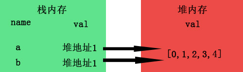

# 深拷贝与浅拷贝

## 如何区分深拷贝和浅拷贝
```
假设B复制了A;
当修改了A时，看B是否会发生变化;
如果B也跟着变了，说明这是浅拷贝;
如果B没变，那就是深拷贝。
```

## 基本数据与复杂（引用）数据
```
基本数据类型：number,string,boolean,null,undefined,symbol(ES6),BigInt(ES10);
引用数据类型：Object,Array,function
```

### 基本数据类型名值存储在栈内存中
例如： let a = 1;

当你b=a复制时，栈内存会新开辟一个内存

所以当你此时修改a=2时，对b并不会对a造成影响，所以深拷贝本身只针对较为复杂的引用数据类型。

### 引用数据类型名存在栈内存中，而值却存在于堆内存中，栈内存会提供一个引用的地址指向堆内存中的值
例如： let a = [0,1,2,3,4]

当b=a进行拷贝时，其实复制的是a的引用地址，而并非是堆内存里面的值

而当我们修改a[0]=1时，由于a与b指向的是同一个地址，所以自然b也受到了影响，这就是浅拷贝了。

那么，我们如何在堆内存中也开辟一个新的内存专门为b存放值，就像基本类型一样，就能达到深拷贝了。


## 如何实现深拷贝
* 


