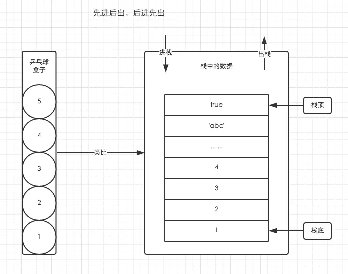

# js中的栈内存和堆内存
JavaScript的内存空间分为栈(stack)、堆(heap)、池(或叫栈中);

### 栈内存和堆内存简介
JavaScript中并没有严格意义上区分栈内存和堆内存。 
1. 栈数据结构 
执行上下文的执行顺序借用了栈数据结构的存取方式；
栈空间的特点：先进后出，后进先出；  
  
由于栈具有后入先出的特点，所以任何不在栈顶的元素都无法访问。  
为了得到栈底的元素，必须先拿掉上面的元素；  
类似乒乓球盒子来分析栈的存取方式。  
```
栈会自动分配内存空间，物理内存是连续的，可以存放基本类型（Boolean,Number,String,undefined,null,Symbol），简单的数据段，引用类型的物理地址；
占用空间小（大小固定），通过按值来访问，属于被频繁使用的数据。  

PS：闭包中的基本数据类型变量不会保存在栈内存中，而是保存在堆内存中。
```

2. 堆数据结构
堆是一种经过排序的树形数据结构，每个结点都有一个值。  
通常我们所属的堆的数据结构，是指二叉堆。  
堆的特点是根结点的值最小（或最大），且根结点的两个子树也是一个堆。  
这种树状结构，它的存储数据的方式是随意的，与书架与书非常相似。我们不关心书的放置顺序是怎样的，只需要知道书的名字就可以取出我们想要的书了。
虽然书的摆放是有顺序的，但我们想取任意一本时不必像栈一样，先取出前面的所有书。
```
引用数据类型（Array,Object, Function）存储在堆内存中，因为引用数据类型占据空间大（大小不固定），如果存储在栈中，将会影响程序运行的性能。
引用数据类型在栈中存储了指针，该指针指向堆中该实体的起始地址。
当解释器寻找引用值时，会首先检索其在栈中的地址，取得地址后从堆中获得实体。

堆内存是动态分配的内存，物理地址不连续，大小不定也不会自动释放内存；
```

3. 队列
在Javascript中，理解队列数据结构的目的主要是为了清晰的明白事件循环（Event Loop）的机制  
队列的特点：先进先出，后进后出。  
 


### 栈内存和堆内存的区别
1. 栈内存：所有在方法中定义的变量都是放在栈内存中，随着方法的执行结束，这个方法的内存栈也自然销毁。
优点：存取速度比堆快，仅次于直接位于CPU中的寄存器，数据可共享；
缺点：存在栈中的数据大小与生存期必须是确定的，缺乏灵活性。

2. 堆内存：堆内存中的对象不会随方法的结束而销毁，即使方法结束后，这个对象海可能被另一个引用变量所引用（参数传递）

### 赋值与赋址
引擎不能直接操作堆内存中的数据，这就造成了对同一个变量赋不同类型的值，会出现完全不同的效果：
为一个变量赋基本值时，实际上是创建一个新值，然后把该值赋给新变量，可以说这是一种真正意义上的“赋值”；
为一个变量赋引用值时，实际上是为新变量添加一个指针，指向堆内存中的一个对象，属于一直“赋址”操作。


### 内存分配和垃圾回收
一般来说栈内存线性有序存储，容量小，系统分配效率高。而堆内存首先要在堆内存新分配存储区域，之后又要把指针存储到栈内存中，效率相对就要比较低一些。  
垃圾回收方面，栈内存变量基本上用完了就回收了，而堆内存中的变量因为存在很多不确定的引用，只有当所有调用的变量全部销毁之后才能回收。

### 脑洞

```
1. const 定义的基本类型不能改变，但是定义的对象是可以通过修改对象属性等方法来改变的。
因为我们定义一个const对象的时候，，我们说的常量其实是一个指针，就是说const对象对应的堆内存指向是不变的，但是堆内存中的数据本身的大小或者属性是可变的。
```

## 参考文案
1. [浅析js中的栈内存和堆内存](https://www.cnblogs.com/heioray/p/9487093.html)
2. [中高级前端必须了解的--JS中的栈内存和堆内存](https://blog.csdn.net/a59612/article/details/93661354)
3. [JavaScript栈内存与堆内存](https://www.jianshu.com/p/0b18e120955b)
4. [详解JavaScript栈内存与堆内存](https://www.jb51.net/article/159120.htm)
5. [js中的栈内存和堆内存](https://blog.csdn.net/qq_36747861/article/details/84958366)
