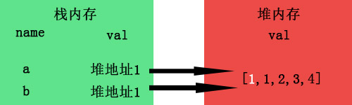

# 深拷贝与浅拷贝

## 如何区分深拷贝和浅拷贝
``` bash
假设B复制了A;
当修改了A时，看B是否会发生变化;
如果B也跟着变了，说明这是浅拷贝;
如果B没变，那就是深拷贝。
```

## 基本数据与复杂（引用）数据
``` bash
基本数据类型：number,string,boolean,null,undefined,symbol(ES6),BigInt(ES10);  
引用数据类型：Object,Array,function
```

### 1.基本数据类型名值存储在栈内存中
例如： let a = 1;  
  
  
当你b=a复制时，栈内存会新开辟一个内存  
  
  
所以当你此时修改a=2时，对b并不会对a造成影响，所以深拷贝本身只针对较为复杂的引用数据类型。  

### 2.引用数据类型名存在栈内存中，而值却存在于堆内存中，栈内存会提供一个引用的地址指向堆内存中的值  
例如： let a = [0,1,2,3,4]  
  
  
当b=a进行拷贝时，其实复制的是a的引用地址，而并非是堆内存里面的值  
  
  
而当我们修改a[0]=1时，由于a与b指向的是同一个地址，所以自然b也受到了影响，这就是浅拷贝了。  
  
  
那么，我们如何在堆内存中也开辟一个新的内存专门为b存放值，就像基本类型一样，就能达到深拷贝了。  
  
  

## 如何实现浅拷贝
1. for...in只循环第一层
``` bash
# 只复制第一层的浅拷贝
function simpleCopy(obj1) {
  var obj2 = Array.isArray(obj1)?[]:{};
  for (let i in obj1) {
    obj2[i] = obj1[i]
  }
  return obj2;
}

var obj1 = {a: 1, b: 2, c: { d: 3}};
var obj2 = simpleCopy(obj1);
obj2.a = 3;
obj2.c.d = 4;
# obj1.a       1;
# obj2.a       3;
# obj1.c.d     4;
# obj2.c.d     4;
```

2. Object.assign
``` bash
var obj = {a: 1, b: 2}
var obj1 = Object.assign({}, obj);

obj1.a = 3;
# obj.a       1;
```
3. 直接用=赋值
``` bash
let a = [0,1,2,3,4];
let b = a;

# a === b       true;
a[0] = 1;
# b[0]        1;
```

## 如何实现深拷贝
1. 采用递归去拷贝所以层级属性
``` bash
function deepClone (obj) {
  let objClone = Array.isArray(obj) ? [] : {};
  if(obj && typeof obj === 'object') {
    for (let key in obj) {
      if(obj.hasOwnProperty(key)) {
        // 判断obj子元素是否为对象，如果是，递归复制
        if(obj[key] && type obj[key] === 'object') {
          objClone[key] = deepClone(obj[key]);
        } else {
          // 如果不是，简单复制
          objClone[key] = obj[key];
        }
      }
    }
  }
  return objClone;
}

let a = [1,2,3,4];
let b = deepClone(a);
a[0] = 2;
# b[0]   1;
```

2. 通过JSON对象来实现深拷贝
``` bash
function deepClone2 (obj) {
  return JSON.parse(JSON.stringify(obj));
}
```
缺点：无法实现对象中方法的深拷贝，会显示为undefined;

3. 通过Jquer的extend方法实现深拷贝
``` bash
let arr = [1,2,3,4];
let newArr = $.extend(true, [], arr);
```

4. 通过lodash函数实现深拷贝
``` bash
let result = _.cloneDeep(test);
```

5. Reflect法
``` bash
# 代理法
function deepClone (obj) {
  if (!isObject(obj)) {
    throw new Error('obj 不是一个对象')
  }
  let isArray = Array.isArray(obj);
  let cloneObj = isArray ? [...obj] : { ...obj };
  Reflect.ownKeys(cloneObj).forEach(key => {
    cloneObj[key] = isObject(obj[key]) ? deepClone(obj[key]) : obj[key];
  })
  return cloneObj;
}
```


## 参考文案
1. [js浅拷贝与深拷贝的区别和实现方式](https://www.jianshu.com/p/1c142ec2ca45)
