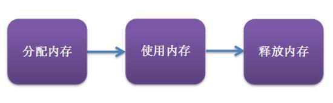
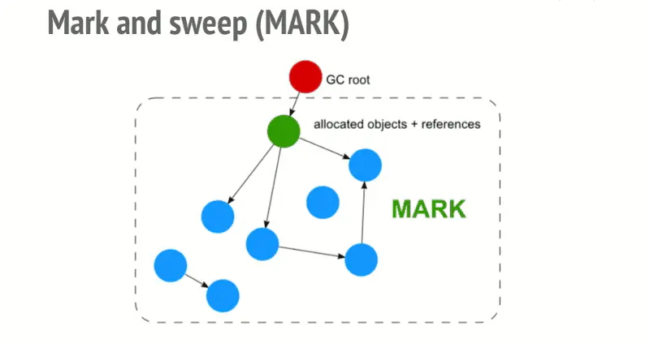

# js中的内存管理

### 1. 内存的生命周期


不管什么语言，内存生命周期基本是一致的：
> 1. 分配你所需的内存
> 2. 使用分配到的内存（读，写）
> 3. 不需要时将其释放/归还
在C语言中，有专门的内存管理接口，像malloc() 和 free()。而在js中，没有专门的内存管理接口，所有的内存管理都是“自动”的。
js在创建变量时，自动分配内存，并在不使用的时候，自动释放。

### 2. JS中的内存回收

  引用
> 垃圾回收算法主要依赖于引用的概念，在内存管理的环境中，一个对象如果有访问另一个对象的权限（隐式或显式），叫做一个对象引用另一个对象。
> 例如：一个Javascript对象具有堆它原型的引用（隐式引用）和它属性的引用（显式引用）。

1. 引用计数垃圾收集
> 这是最简单的垃圾回收机制算法。此算法把“对象是否不再需要”简化定义为“对象有没有其他对象引用到它”。如果没有引用指向对象（零引用，对象将被垃圾回收机制回收）
例：
```js
let arr = [1, 2, 3, 4];
arr = null; // [1, 2, 3, 4]这时没有被引用，会被自动回收
```
2. 限制：循环引用
> 两个对象被创建并相互引用，就造成零循环引用。它们被调用之后不会离开函数的作用域，所以它们已经没用零，可以被回收了。然而，引用计数算法考虑它们相互都有至少一次引用，所以它们不会被回收
例：
```js
function f() {
  var o1 = {};
  var o2 = {};
  o1.p = o2; // o1 引用了 o2
  o2.p = o1; // o2 引用了 o1
}
f();
```
```js
var div;
window.onload = function () {
  div = document.getElementById("myDivElement");
  div.circularReference = div;
  div.lotsOfData = new Array(10000).join("*");
};
```
> 上面的例子里，myDivElement这个Dom元素的circularRerence属性引用了myDivElement造成了循环引用。IE6，7使用引用计数方式对DOM对象进行垃圾回收。该方法常常造成对象被循环引用时内存发生泄露。现代浏览器通过使用标记-清除内存回收算法，来解决这一个问题。

3. 标记-清楚算法
> 这个算法把“对象是否不再需要”简化定义为“对象是否可以获得”。  
> 
> 这个算法假定设置一个叫根root的对象（在JavaScript里，根是全局对象）。垃圾回收器将从根开始定期的找所有从根开始引用的对象，然后找这些对象引用的对象，从根开始，垃圾回收器将找到所有可以获得的对象和所有不能获得的对象。 
> 
> 从2012年起，所有现代浏览器都使用了标记-清除内存回收算法。所有对JavaScript垃圾回收算法的改进都是基于标记-清除算法。



4. 自动GC垃圾回收机制
> 尽管自动GC很方便，但是我们不知道GC什么时候会进行。这意味着如果我们在使用过程中使用了大量的内存，而GC没有运行的情况下，或者GC无法回收这些内存的情况下，程序就有可能假死，这个就需要我们在程序中手动做一些操作来触发内存回收了。

### 3. 什么是内存泄露？

本质的讲，内存泄露就是不再被需要的内存，由于某种原因，无法被释放。

### 4. 常见的内存泄露案例

1. 全局变量
```js
function foo (arg) {
  bar = "some text";
}
```
> 在js中处理未被声明的变量，上述范例中的bar时，会把bar定义到全局对象中，在浏览器中就是window上。在页面中的全局变量，只有当页面被关闭后才会被销毁。所以这种写法就会造成内存泄露，当然这个例子中的泄露的只是一个简单的字符串，但是在实际的代码中，往往情况会更加糟糕。  
> 
> 另外一种意外创建全局变量的情况。
```js
function foo () {
  this.var1 = "potential accidental global";
}
// foo 被调用时，this指向全局变量window
foo();
```
> 这种情况下调用foo，this被指向了全局变量window，意外的创建了全局变量。  
> 
> 我们谈到了一些意外情况下定义的全局变量，代码中也有一些我们明确定义的全局变量。如果使用这些全局变量用来暂存大量的数据，记得在使用后，对其重新赋值为null。

2. 未销毁的定时器和回调函数
> 很多库中，如果使用了观察者模式，都会提供回调方法，来调用一些回调函数。要记得回收这些回调函数。例：
> ```js
> var serverData = loadData();
> setInterval(function () {
>   var renderer = document.getElementById('renderer');
>   if (renderer) {
>     renderer.innerHTML = JSON.stringify(serverData);
>   }
> }, 5000); // 每5秒调用一次
> ```
> 如果后续renderer元素被移除，整个定时器实际上没有任何作用。但是如果你没有回收定时器，整个定时器依然有效，不但定时器无法被内存回收，定时器函数中的依赖也无法回收(serverData也无法被回收)。

3. 闭包
> 在js开发中，我们经常会用到内部函数，有权访问包含它的外部函数的变量。
> 注意下面这种情况，闭包也会造成内存泄露
> ```js
> var theThing = null;
> var replaceThing = function () {
>   var originalThing = theThing;
>   var unused = function () {
>     if (originalThing) { // 对于‘originalThing’的引用
>       console.log('hi')
>     }
>   }
>   theThing = {
>     longStr: new Array(1000000).join('*'),
>     someMethod: function () {
>       console.log('message');
>     }
>   }
> }
> setInterval(replaceThing, 10000);
> ```
> 每次调用replaceThing时，theThing获得了包含一个巨大的数组和一个对于新闭包someMethod的对象，同时unused是一个引用了originalThing的闭包。  
> 闭包之间是共享作用域的，尽管unused可能一只都没有被调用，但是someMethod可能会被调用，就会导致内存无法对其进行回收。

4. DOM引用
> ```js
> var elements = {
>   image: document.getElementById('image')
> };
> function doStuff() {
>   elements.image.src = 'http://example.com/img.png';
> }
> function removeImage() {
>   document.body.removeChild(document.getElementById('image'));
>   // 这个时候，我们对于#image 仍然有一个引用，Image元素仍然无法被内存回收。
> }
> ```
> 注意：  
> 如果我们引用了一个表格中的td元素，一旦在DOM中删除了整个表格，我们直观的认为内存回收应该回收了除了有引用的td外的其他元素，但是事实上，这个td元素是整个表格的一个子元素，并保留对于其父元素的引用。这个就会导致整个表格都无法进行内存回收。所以我们要小心处理DOM元素的引用。

### ES6
> ES中引入了WeakSet和WeakMap两个新概念，来解决引用造成的内存回收问题。WeakSet和WeakMap对于值的引用可以忽略不计，它们对于值的引用都是弱引用，内存回收机制不会考虑这种引用。当其他引用被消除之后，引用就会被内存中释放。  
> 
  
## 参考文档
1. [JS中的内存管理](https://www.jianshu.com/p/b31c7d5e8311)
