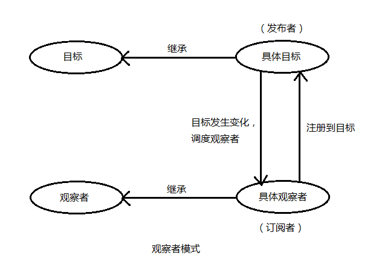
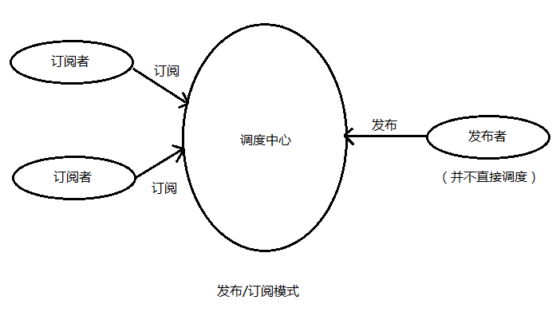

## 观察者模式和发布/订阅模式

> ### 观察者模式
> 目标和观察者是基类，目标提供维护观察者的一系列方法，观察者提供更新接口。具体观察者和具体目标继承各自的基类，然后具体观察者把自己注册到具体目标里，在具体目标发生变化时候，调度观察者的更新方法。  
> 
> 观察者模式实现代码  
> ```js
> // 1. 观察者列表
> function ObserverList() {
>   this.observerList = [];
> }
> ObserverList.prototype.add = function(obj) {
>   return this.observerList.push(obj);
> }
> ObserverList.prototype.count = function() {
>   return this.observerList.length;
> }
> ObserverList.prototype.get = function(index) {
>   if(index > -1 && index < this.observerList.length) {
>     return this.observerList[index];
>   }
>   return null;
> }
> ObserverList.prototype.indexOf = function(obj, startIndex) {
>   var i = startIndex || 0;
>   while(i < this.observerList.length) {
>     if(this.observerList[i] === obj) {
>       return i
>     }
>     i++;
>   }
>   return -1;
> }
> ObserverList.prototype.removeAt = function(index) {
>   this.observerList.splice(index, 1);
> }
> 
> // 2.目标
> function Subject() {
>   this.observers = new ObserverList();
> }
> Subject.prototype.addObserver = function(observer) {
>   this.observers.add(observer);
> }
> Subject.prototype.removeObserver = function(observer) {
>   this.observers.removeAt(this.observers.indexOf(observer, 0));
> }
> Subject.prototype.notify = function(context) {
>   var observerCount = this.observers.count();
>   for(var i = 0; i < observerCount; i++) {
>     this.observers.get(i).update(context);
>   }
> }
> 
> // 3.观察者
> function Observer() {
>   this.update = function() {
>     //...
>   }
> }
> ```
> 使用范例
> ```js
> // html 
> // <button id="addNewObjserver">add New Observer checkBox</button>
> // 
> ```

> ### 发布/订阅模式
> 订阅者把自己想订阅的事件注册到调度中心，当该事件触发的时候，发布者发布该事件到调度中心，由调度中心同意调度订阅者注册到调度中心的处理代码。
> 
> 发布/订阅模式实现代码
> ```js
> var pubsub = {};
> (function(myObject) {
>   var topics = {};
>   var subUid = -1;
>   myObject.publish = function(topic, args) {
>     if(!topics[topic]) {
>       return false;
>     }
>     var subscribers = topics[topic];
>     var len = subscribers ? subscribers.length : 0;
>     while (len--) {
>       subscribers[len].func(topic, func);
>     }
>     return this;
>   };
>   myObject.subscribe = function(topic, func) {
>     if(!topics[topic]) {
>       topics[topic] = [];
>     }
>     var token = (++subUid).toString();
>     topics[topic].push({
>       token: token,
>       func: func
>     });
>     return token;
>   }
>   myObject.unsubscribe = function(token) {
>     for(var m in topics) {
>       if(topics[m]) {
>         for(var i = 0, j = topics[m].length; i < j; i++) {
>           if(topics[m][i].token === token) {
>             topics[m].splice(i, 1);
>             return token;
>           }
>         }
>       }
>     }
>     return this;
>   }
> })(pubsub)
> ```


> ### 参考文档
> 1. [观察者模式和发布订阅模式的区别](https://www.jianshu.com/p/594f018b68e7)
> 2. [设计模式学习之观察者模式和发布订阅模式](https://www.jianshu.com/p/9f2c8ae57cac)
> 3. [观察者模式与发布/订阅模式区别](https://www.cnblogs.com/lovesong/p/5272752.html)
> 4. [JS设计模式2-发布／订阅模式和观察者模式](https://www.jianshu.com/p/2f94d7596522)